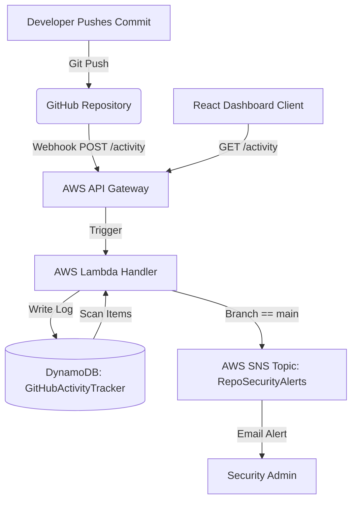

# Automated Serverless Data Tracker 🚀

A real-time GitHub activity monitoring dashboard built with a serverless AWS backend and a modern React + TypeScript client. The system automatically tracks push events from multiple repositories, securely alerts on direct commits to critical branches (like `main`), and visualizes statistics dynamically.

---

## 🏗️ Architecture Overview

The system operates on an event-driven serverless architecture:



1. **GitHub Webhooks**: Triggers on `push` events and sends a JSON payload to the API Gateway.
2. **AWS API Gateway**: Acts as the HTTP entry point, routing requests to the Lambda function.
3. **AWS Lambda**: 
   - Handles `POST` requests from GitHub: parses the payload, extracts user metadata (Pusher, Branch, Commit Message, Repository Name), logs it in DynamoDB, and publishes security alerts to SNS if a push occurred directly on the `main` branch.
   - Handles `GET` requests from the dashboard: scans DynamoDB and returns sorted repository history.
4. **DynamoDB**: Key-value serverless database storing tracking details.
5. **React Dashboard**: Renders real-time statistics (total commits, unique contributors, branch metrics) in a responsive dark glassmorphism interface.

---

## ⚡ Backend Setup (AWS Services)

### 1. DynamoDB Table
* **Table Name**: `GitHubActivityTracker`
* **Partition Key**: `EventID` (String)

### 2. SNS Topic (Optional for Alerts)
* **Name**: `RepoSecurityAlerts`
* **Protocol**: Email (Subscribe your email address to receive notifications on direct pushes to `main`).

### 3. AWS Lambda Function
* **Runtime**: Node.js 20.x or 22.x (using standard ES module imports).
* **Environment Variables**: Add your SNS Topic ARN if needed.
* **IAM Policy Permissions**:
  The Lambda execution role requires permission to write to DynamoDB and publish to SNS:
  ```json
  {
      "Version": "2012-10-17",
      "Statement": [
          {
              "Effect": "Allow",
              "Action": [
                  "dynamodb:PutItem",
                  "dynamodb:Scan"
              ],
              "Resource": "arn:aws:dynamodb:YOUR_REGION:YOUR_ACCOUNT_ID:table/GitHubActivityTracker"
          },
          {
              "Effect": "Allow",
              "Action": "sns:Publish",
              "Resource": "arn:aws:sns:YOUR_REGION:YOUR_ACCOUNT_ID:RepoSecurityAlerts"
          }
      ]
  }
  ```

### 4. AWS API Gateway
* Create an **HTTP API** or **REST API**.
* Create a resource path `/activity`.
* Configure two methods:
  - `POST /activity`: Integrates with the Lambda function to receive webhooks.
  - `GET /activity`: Integrates with the Lambda function to serve React frontend queries.
* **Enable CORS**:
  Ensure CORS headers are enabled under the API Gateway options:
  - **Access-Control-Allow-Origin**: `*` (or your frontend deployment domain)
  - **Access-Control-Allow-Methods**: `GET, POST, OPTIONS`
  - **Access-Control-Allow-Headers**: `Content-Type`
* Deploy your API to a stage (e.g. `prod` or `dev`).

---

## 💻 Frontend Client Setup (React + Vite)

### Prerequisites
Make sure you have [Node.js](https://nodejs.org/) (v18+) and `npm` installed.

### 1. Installation
Navigate to the project root directory and install dependencies:
```bash
npm install
```

### 2. Configuration
Open `Dashboard.tsx` and configure the `API_URL` to point to your deployed API Gateway stage URL:
```typescript
const API_URL = 'https://YOUR_API_ID.execute-api.ap-southeast-2.amazonaws.com/prod/activity';
```

### 3. Running Locally
Launch the Vite local development server:
```bash
npm run dev
```
The application will start running on **[http://localhost:3000](http://localhost:3000)** and automatically open in your default browser.

### 4. Build for Production
Create an optimized production bundle:
```bash
npm run build
```
This outputs compiled, minified HTML/JS/CSS assets to the `dist/` directory, which can be hosted on AWS S3, Vercel, Netlify, or GitHub Pages.

---

## 🔗 Configuring GitHub Webhooks

To hook up your repositories and start tracking commits:

1. Go to your repository on GitHub.
2. Select **Settings** ➡️ **Webhooks** ➡️ **Add Webhook**.
3. **Payload URL**: Enter your API Gateway URL (`https://YOUR_API_ID.execute-api.YOUR_REGION.amazonaws.com/prod/activity`).
4. **Content type**: Choose `application/json`.
5. **Which events**: Select **Just the push event**.
6. Click **Add Webhook**.
7. Repeat the steps above for any other repositories you want to track on the same dashboard.
